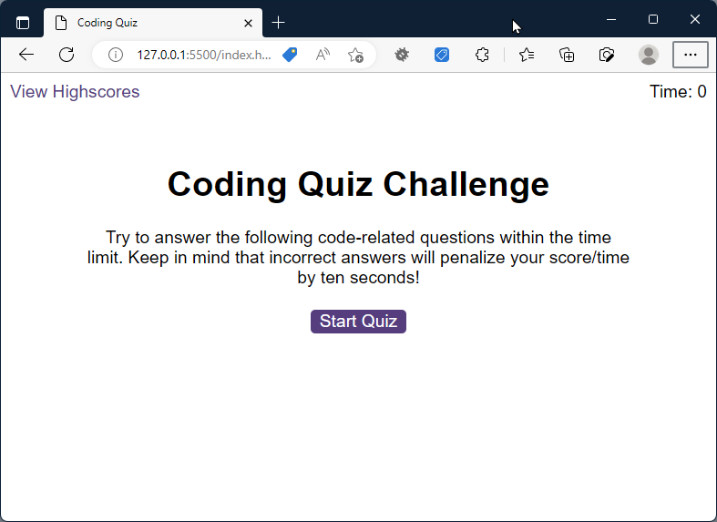
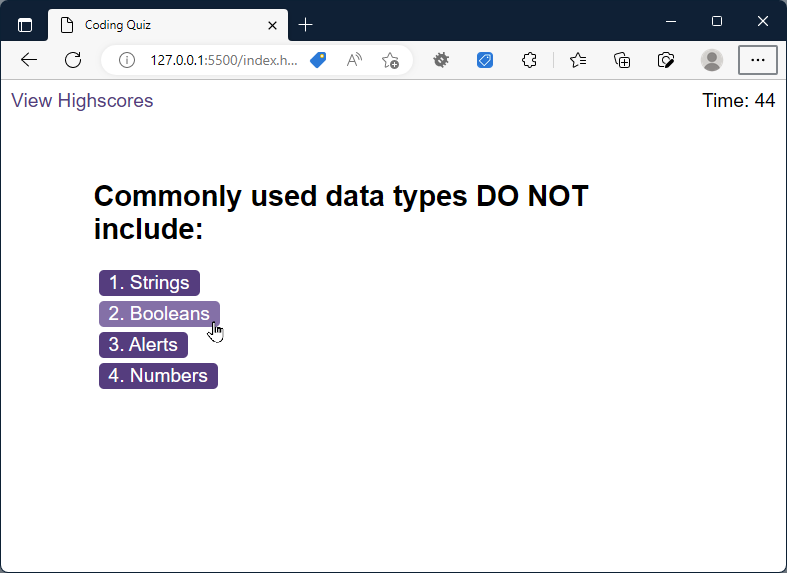
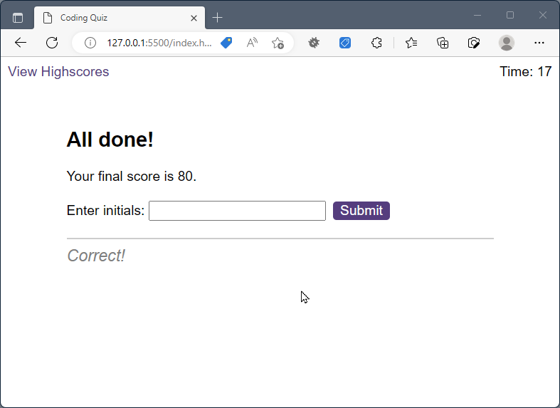
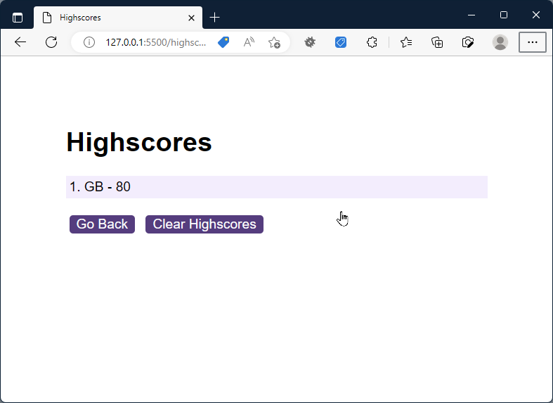

# Challenge - Code Quiz

## Description

A code quiz that is timed to test the basic skills of JavaScript developers. The player is presented with a series of questions with multiple-choice answers. 

Once the player has answered all the questions, they will be graded and shown their score. The player will be given an option of saving their score which will appear in the Highscores table.

**Note: Turn up speaker volume to hear the sounds 🎵**

## Live demo

[View deployed application on Github Pages](https://gurdeep-ninja.github.io/Code-Quiz/)

## Screenshots

## Installation & usage

Clone or download this project as a zip file & extract to your websites root directory.

Simply open the `index.html` file in your browser to start the quiz

The application works in any web browser with JavaScript enabled - including mobile/tablet responsive devices.
## Technologies
    